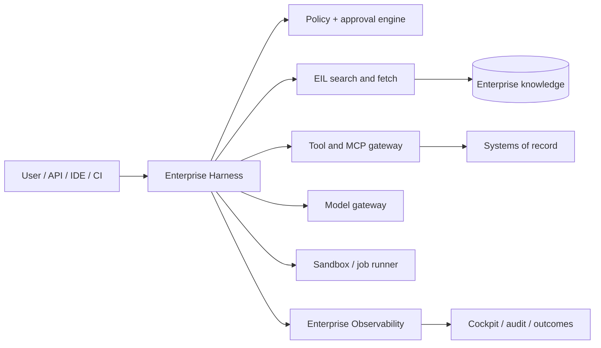

# Enterprise Harness

Product and architecture blueprint for a governed enterprise agent harness that composes the Enterprise Intelligence Layer (EIL), enterprise tools, models, sandboxes, approvals, and the Enterprise Observability Layer into auditable workflows.

**Status: design only. No runtime implementation is authorized.**

## Product decision

Build a thin orchestration control plane, not another knowledge platform and not a monolithic autonomous agent.

- **EIL** owns ingestion, normalized knowledge, source ACLs, indexing, retrieval, citations, and freshness.
- **Enterprise Harness** owns workflow composition, capability discovery, policy checks, execution state, approvals, resumability, and evidence emission.
- **Enterprise Observability** owns durable run evidence, lineage, cost/token/time measurement, verified outcomes, and fleet-level analysis.
- **Systems of record** remain authoritative for Jira, Confluence, Git, CI/CD, incidents, and approvals.

## The pack model

`Pack` is a tagged union, never a flat plugin list:

- A **knowledge pack** is a signed, versioned manifest that selects governed EIL resources for a purpose. It is searched and fetched. It is not a ZIP of copied enterprise data and not an independent vector index.
- A **tool pack** selects MCP/tool capabilities. It is invoked and may cause side effects, so it follows separate trust, approval and credential paths.

Conflating the two is a security defect: EIL can fail closed per document, while a side effect cannot be undone by filtering its result.

A pack contains:

- identity, semantic version, owner, purpose, classification, tenancy and expiry;
- immutable resource references and source/version digests;
- retrieval defaults, evaluation set, compatible tools and workflow recipes;
- authorization requirements, policy labels and dependency locks;
- signatures, provenance and a reproducible build receipt.

The EIL remains the source of truth. A knowledge pack is a filter, never a grant. At runtime the harness resolves it against the real caller identity, rechecks access, freshness and policy, then requests cited snippets or full resources from EIL. Portable offline snapshots are a separate, explicitly exported pack profile with encrypted content, bounded TTL and revocation limitations.

## Product surfaces

1. **Pack registry** — discover, inspect, validate, promote, deprecate and audit packs.
2. **Workflow catalog** — approved reusable recipes such as incident triage, change planning and code remediation.
3. **Run console** — plan, approve, execute, pause, resume, cancel and inspect a run.
4. **Capability catalog** — models, MCP servers, tools, sandboxes and connectors with trust and policy metadata.
5. **Evidence view** — citations, decisions, mutations, approvals, tests and outcome links supplied by Observability.
6. **Administration** — tenant policy, quotas, identities, pack promotion, kill switches and retention.

## Documents

- [Product and organizational model](docs/PRODUCT.md)
- [Architecture and technology choices](docs/ARCHITECTURE.md)
- [Pack specification](docs/PACK_SPEC.md)
- [Pack resolution, partial views and freshness](docs/PACK_RESOLUTION.md)
- [Pack-value measurement](docs/MEASUREMENT.md)
- [Adoption, identity ceiling and product decomposition](docs/ADOPTION_AND_DECOMPOSITION.md)
- [Security and governance](docs/SECURITY_AND_GOVERNANCE.md)
- [Delivery plan and decision gates](docs/DELIVERY_PLAN.md)
- [DeepSeek Harness comparison](docs/REFERENCE_ASSESSMENT.md)
- [Architecture decision records](docs/adr/README.md)

## Corporate endpoint constraint

Corporate laptops cannot install DeepSeek Harness or other unapproved runtime software. DeepSeek Harness is therefore architecture research only: not a dependency, fork, bundle, adapter, reference client or fallback.

Enterprise Harness is a centrally managed service exposed through enterprise-authenticated remote MCP/HTTPS. Developers keep using already-approved Copilot, Amp or IDE clients. EIL access, policy, credentials, models, tools, run state, sandboxing and telemetry execute on approved infrastructure. The endpoint receives no harness runtime, corpus, plugin engine or long-lived credential.

## Recommended pilot

Start with one bounded, read-heavy workflow through an already-approved client: **Jira change request → approved Confluence and code packs → cited change plan and acceptance criteria → evidence bundle**. Add sandboxed patch/test only after read-only value and identity propagation are proven.

The pilot should use one model route, one source-control provider, read-only Jira/Confluence access, and a disposable code sandbox. Mutations remain approval-gated. Do not begin implementation until the decisions in [Delivery plan](docs/DELIVERY_PLAN.md) are approved.

The corporate pilot is remote-service-only and is blocked until EIL provides tested per-user identity over HTTP MCP. The harness must not centralize behind a privileged EIL service credential. Development may use isolated test environments, but local developer topology is not a corporate product deployment rung.

## Explicit non-goals

- replacing EIL storage, indexing or retrieval;
- copying all enterprise content into pack files;
- allowing plugins to bypass identity, policy, telemetry or approval;
- autonomous production changes or self-approval;
- hidden chain-of-thought capture;
- individual employee productivity scoring;
- a universal workflow language before two real workflows prove common needs;
- microservices, Kafka, a graph database or a second vector store without measured need.

## Sources

- [DeepSeek Harness](https://github.com/deepseek-ai/deepseek-harness) and its [architecture](https://github.com/deepseek-ai/deepseek-harness/blob/master/docs/architecture.md)
- [Enterprise Intelligence Layer](https://github.com/ashark-ai-05/enterprise-intelligence-layer)
- Local observability baseline: `../enterprise-ai-effectiveness-observatory/README.md`
