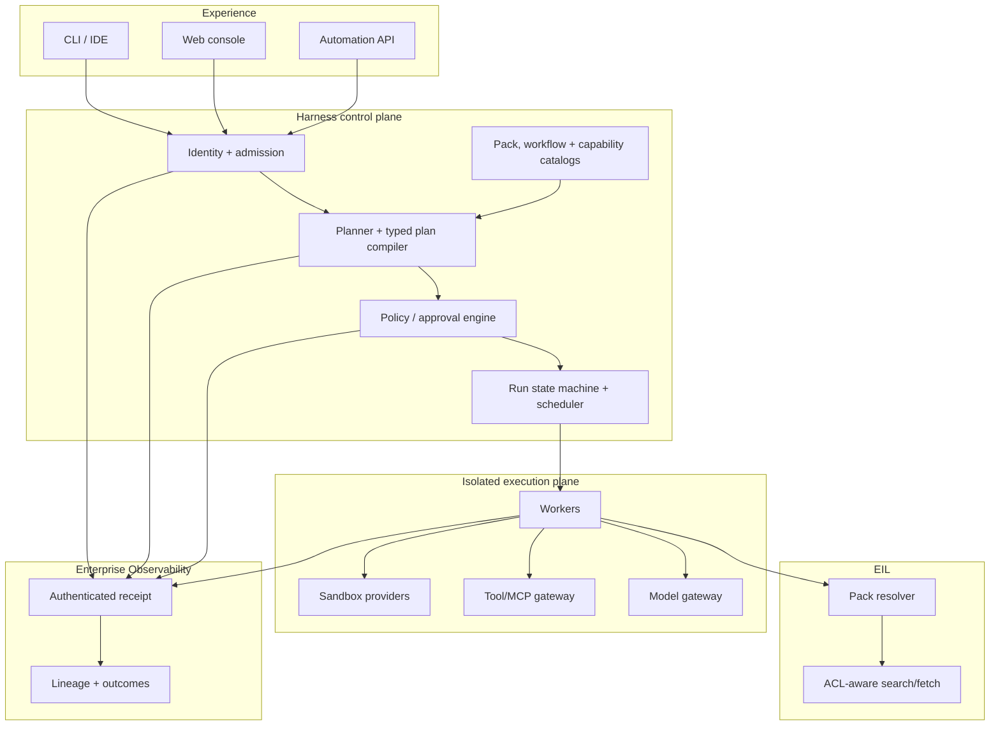

# Architecture and Technology Choices

## Context

The harness sits between user intent and enterprise capabilities. It must coordinate long-running, resumable workflows while preserving EIL authorization and producing Observability evidence. It must not become a privileged bypass around either platform.

## Logical architecture

## Runtime contract

1. Authenticate user/service and bind tenant, groups, purpose and device/workload context.
2. Resolve workflow, pack and capability versions to immutable digests.
3. Produce a typed plan containing inputs, dependencies, claimed capabilities, budgets and expected evidence.
4. Evaluate policy. Insert human approval steps where required; rejected capabilities never reach the model tool schema.
5. Execute admitted steps in a tenant-scoped worker/sandbox. Every side effect receives an idempotency key.
6. Emit signed step lifecycle events and artifact digests to Observability.
7. Verify outputs using deterministic validators or external systems of record.
8. Checkpoint the run and publish a result/evidence manifest.

## Plugin model

Adopt DeepSeek Harness's composability idea, not unrestricted in-process plugins.

A plugin is a signed package plus a declarative manifest:

- identity, version, publisher and software-bill-of-materials digest;
- capability types and typed input/output schemas;
- network, filesystem, secret, data-class and mutation requirements;
- supported deployment modes and isolation level;
- event schemas, health checks and conformance tests;
- minimum harness/API versions and rollback information.

Plugin classes:

- **connector** — source/system adapter;
- **retriever** — EIL pack/search/fetch adapter;
- **tool** — model-callable or deterministic capability;
- **model** — approved inference route;
- **sandbox** — execution isolation provider;
- **policy** — admission/approval extension;
- **workflow** — reusable typed step graph;
- **presenter** — CLI/UI rendering only.

Trust tiers:

1. pure in-process transforms with no I/O;
2. out-of-process tools with bounded filesystem/network access;
3. enterprise services reached through authenticated gateways;
4. mutation capabilities requiring scoped credentials and approval.

All I/O crosses host-owned gateways. A plugin cannot emit directly to arbitrary networks, mint credentials, weaken policy, or suppress telemetry. Hot unload is not a phase-one requirement; reproducible process restart is safer.

## Workflow representation

Use a versioned typed DAG, not arbitrary model-generated code. Core step types:

`resolve_pack`, `search`, `fetch`, `model`, `tool`, `sandbox_job`, `approval`, `validate`, `publish`, `wait`, `join`.

Each step declares:

- stable ID, type, version and dependencies;
- principal/purpose and requested capabilities;
- typed inputs and outputs with classification;
- retry, timeout, idempotency and compensation behavior;
- token, cost, concurrency and wall-time budgets;
- approval and evidence requirements;
- telemetry content policy.

The planner may propose this graph. Schema validation, capability resolution and policy admission are deterministic. Dynamic expansion is allowed only through a bounded `expand` result with fan-out and depth limits.

## Control-plane persistence

Start with PostgreSQL as authority for tenants, identities, catalogs, policy bindings, workflow/run state, approvals, leases and idempotency. Store immutable manifests, large artifacts and encrypted payloads in approved object storage. Use PostgreSQL job leasing/outbox patterns for the pilot; add a broker only after queue latency, throughput or blast-radius measurements justify it.

Do not store EIL document bodies or duplicate Observability event facts in harness tables. Keep references and delivery receipts.

## Technology recommendation

| Concern | Initial choice | Reason |
|---|---|---|
| Runtime/API | TypeScript on current enterprise Node LTS | aligns with EIL/Observability prototypes and MCP ecosystem; strong schema tooling |
| Contracts | JSON Schema + generated TypeScript types | language-neutral, versionable, policy-friendly |
| API | REST/JSON for control; SSE for live events | operationally simple; resumable UI streams |
| Tool protocol | MCP behind a harness gateway | ecosystem interoperability without making MCP the policy boundary |
| Telemetry | OpenTelemetry + versioned harness semantic contract | vendor-neutral transport; domain-specific facts remain explicit |
| State | PostgreSQL | transactions, leases, outbox, JSON, mature operations |
| Artifacts | approved S3-compatible object store | immutable manifests and large evidence objects |
| Policy | embedded policy adapter; evaluate OPA/Rego in phase 0 | avoid committing before enterprise policy ownership and latency are known |
| Sandbox | provider interface over approved container/job platform | isolation and portability; local subprocess is development-only |
| UI | thin web console consuming the same API | no alternate business logic |
| Packaging | OCI artifacts plus signed manifests/SBOM | provenance, scanning and promotion |

Python and other language tools run out of process behind contracts. Rust is appropriate only for measured hot paths or isolation helpers, not as an up-front architectural commitment.

## EIL integration

Required EIL interfaces:

- `packs.resolve(pack_digest, principal, purpose)`;
- `search(query, scope_token, filters, limit)`;
- `fetch(resource_ref, scope_token)`;
- `explain(result_set)` and citation metadata;
- freshness, revocation and source-version checks;
- ingestion/build status for pack publishers.

Search remains deterministic and LLM-free. The harness chooses when to retrieve and how to use results; it does not re-rank around EIL ACL enforcement. Returned context records the pack, query, result/resource versions and authorization decision.

## Observability integration

Emit metadata-first canonical events for run, plan, step, model call, tool call, retrieval, approval, artifact, policy decision, error and outcome link. Every event carries tenant, run/trace/span IDs, producer/schema versions, observed/received time, idempotency key, capture policy, resource/capability digests and attribution evidence.

Payload bodies remain outside telemetry by default. Capture digests, classifications and references. The harness cannot declare its own business outcome successful; Observability joins external evidence such as tests, CI, review, merge and deployment.

## Deployment and scaling

Begin as a modular monolith with separately runnable API, scheduler and worker roles. Scale workers by queue/capability/tenant class. Use leases and fencing for execution; transactional outbox for commands/events; dead-letter state plus operator replay; per-tenant quotas; regional data residency; graceful draining; and kill switches by plugin, workflow, tenant and model.

Only split services where scaling, ownership, isolation or regulatory boundaries demand it. The first likely separations are sandbox execution and high-volume event export, not catalogs.

## Failure semantics

- At-least-once delivery, idempotent step effects.
- A step is never marked successful without its required evidence.
- Unknown completion after timeout enters `reconcile_required`; do not blindly retry a mutation.
- Revoked pack/capability versions stop new steps; in-flight policy decides cancel versus drain.
- EIL unavailable: fail closed for required knowledge; do not use stale local context unless the pack explicitly permits a bounded snapshot.
- Observability unavailable: durable local/outbox buffering within limits; stop consequential mutations if audit delivery exceeds policy threshold.

