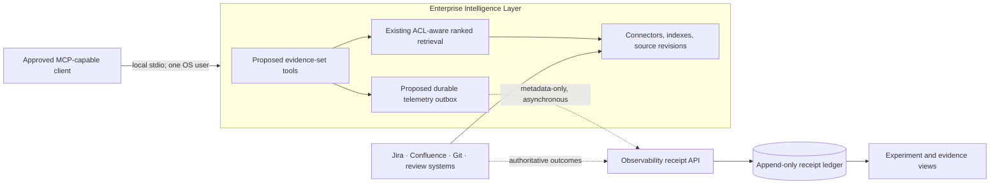
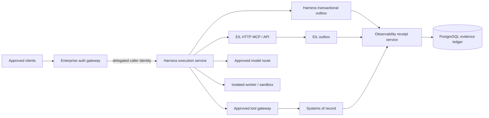

# Enterprise Harness — Product Blueprint

**Status:** architecture and product design only. This is not approval to build a Harness runtime.

## 1. The product, precisely

Enterprise Harness is **not another agent, knowledge store, IDE, or MCP marketplace**. It is a future governed-execution control plane that turns an approved intent into an attributable, policy-bounded run across existing enterprise systems.

Before that product exists, its only justified pilot is an **EIL-native evidence-set capability**: a named, owned, versioned retrieval scope that makes a repeatable work context reusable without copying source content or granting access.

```text
Now:     approved client → EIL evidence set → cited read-only plan → evidence receipt
Later:   approved client → Harness run → EIL + approved tools + approvals → verified outcome
Never:   Harness replaces EIL, becomes a second enterprise index, or holds blanket authority.
```

### Product boundary

| Plane | Owns | Must not own |
|---|---|---|
| **EIL** | ingestion, source ACLs, retrieval, source revisions, citations, freshness signals | workflow state, approvals, tool execution, outcome claims |
| **Evidence-set pilot** | named selectors, versioning, caller-scoped resolution, experiment metadata | copied content, an ACL system, model routing, automation |
| **Future Harness** | plans, capability admission, durable run state, approvals, sandboxed execution, evidence emission | a second corpus/index, source-system truth, observability retention |
| **Observability** | durable receipts, lineage, telemetry completeness, cost/time, outcome joins, fleet analysis | source ACL decisions, tool authorization, claims that an inferred link is certain |
| **Systems of record** | Jira, Git/PRs, CI/CD, incidents and formal approvals | delegation to an LLM |

## 2. User journey and functions

### Pilot: cited change planning

1. A developer opens an already-approved MCP-capable client and chooses a named evidence set, such as `payments-change-planning`.
2. EIL resolves the set **as that caller**, narrowing source/container/path selectors while rechecking the caller's real ACL on every retrieval/fetch.
3. The client searches Jira, Confluence and code through EIL's normal ranked retrieval route; it does not fetch an unranked list of locked IDs.
4. EIL returns cited evidence and machine-readable limitation state: unavailable/stale sources, ACL drift, or a caller-safe partial-view flag.
5. The model drafts a change plan and acceptance criteria. No mutation is available in this pilot.
6. The user accepts, edits or rejects the draft in a system of record.
7. EIL and the client emit metadata-only correlated events. Observability later joins those facts to authoritative acceptance/PR/CI outcomes.
8. The experiment compares: **A** whole authorized corpus; **B** equivalent inline filters; **C** named evidence set. C must beat B in reuse, setup or accepted outcomes without recall/safety regression, or the evidence-set product stops.

### Evidence-set functions (pilot scope)

- **Author / validate:** owner, purpose, expiry, source selectors, expected source families, freshness policy and known-answer tests.
- **Version / resolve:** immutable manifest version plus a content-free resolution receipt, resolved as the real caller.
- **Search / fetch:** EIL's existing ACL-aware retrieval and explicit re-authorized evidence fetch.
- **Disclose:** stale, unavailable and partial evidence must be visible to the user/model; an empty partial result must not become a negative conclusion.
- **Evaluate:** A/B/C assignment, result-quality checks, independent re-use and telemetry completeness.
- **Deprecate:** named owner, review date and expiry; removal never deletes source content.

### Future Harness functions (not pilot scope)

Only after Gate 3, the Harness would add:

- a plan compiler for a **bounded typed run**, not open-ended agent loops;
- capability catalog and policy admission before a model can see tools;
- human approval queue and mutation tiers;
- durable run/step state, cancellation, idempotency and reconciliation;
- approved sandbox/job workers and credential brokerage;
- a run/evidence console that links, but does not replace, source-system records.

## 3. Design mockups

### A. Evidence-set authoring — designed to prove value, not imply access grants

```text
┌──────────────── Evidence set: Payments change planning ───────────────┐
│ DRAFT · Owner: Payments Platform · Review by: 2026-11-16              │
│ Purpose: cited change plans only — no mutation authority               │
├────────────────────────────────────────────────────────────────────────┤
│ SOURCES                                                                │
│ ✓ Jira         Project PAY                                             │
│ ✓ Confluence   Space PAY · architecture, runbook                       │
│ ✓ Git          payments-api · src/** · docs/**                         │
│ Expected: Jira / Confluence / Git    Freshness: degrade after 7 days   │
├────────────────────────────────────────────────────────────────────────┤
│ EVALUATION                                                             │
│ Known-answer recall    Whole: 8/10   Inline: 9/10   Set: 9/10          │
│ Context precision      Whole: 42%    Inline: 71%    Set: 73%           │
│ ACL / deletion tests   PASS          Partial-view disclosure: BLOCKED  │
│                                                                        │
│ [Preview as me] [Run evaluation] [Save draft] [Publish v1 — blocked]  │
└────────────────────────────────────────────────────────────────────────┘
```

The design is deliberately dense and evidence-first: no generic KPI-card dashboard, no claim that publishing gives users access, and a visibly blocking limitation state.

### B. Cited change-plan result — evidence and uncertainty are primary UI

```text
┌──────────────────── Change plan: PAY-4471 ────────────────────────────┐
│ Evidence set payments-change@1 · resolution 7f2… · Draft              │
│                                                                        │
│ ⚠ LIMITED EVIDENCE: Git stale (3d); your visible pack may be partial. │
│ Empty search results must not be interpreted as “nothing exists”.      │
├────────────────────────────────────────────────────────────────────────┤
│ Acceptance criteria                                                    │
│ 1. Retry transient gateway failures only.      [PAY-4471] [Runbook §4]│
│ 2. Cap retry attempts at three.                [retry.ts L42–88]       │
│                                                                        │
│ Evidence drawer (6)                                                    │
│ ✓ Jira PAY-4471        synced 12m ago    direct object                  │
│ ✓ Retry runbook        synced 2h ago     lexical + semantic             │
│ ⚠ retry.ts             synced 3d ago     stale                           │
├────────────────────────────────────────────────────────────────────────┤
│ Experiment: named set · equivalent inline baseline recorded            │
│ Telemetry completeness: pending receipt acknowledgement                │
│ Outcome: not yet verified                                              │
│ [Reject] [Edit] [Accept draft] [Open evidence receipt]                 │
└────────────────────────────────────────────────────────────────────────┘
```

The key wording is **Accept draft**, not “successful outcome.” Outcome authority stays with Git/CI/Jira/incident systems.

## 4. Architecture

### As-is / pilot architecture



**Rules:** Observability is never synchronous in the retrieval path; source systems remain outcome authorities; shared use is prohibited while EIL has only local/ambient identity; dashed components are enhancements, not current capabilities.

### Conditional shared-service target



This is **not funded architecture**. It is allowed only after shared identity, authoritative approvals, remote sandboxing, operational ownership and measured demand are demonstrated.

## 5. How EIL and Observability are used

### EIL contract

The Harness/evidence set supplies only caller-scoped constraints: source, container, repository, path, object identity and policy metadata. EIL must:

- verify caller identity and ACLs at query and fetch time;
- apply the scope as a predicate on its regular ranked retrieval path;
- return citations, stable resource/revision identity, sync/freshness information and caller-safe limitation state;
- never accept a client-supplied principal as authority;
- never rely on pack filtering to compensate for a broad service credential.

### Observability contract

A run/event envelope needs: schema and producer versions, tenant/principal pseudonym, run/trace/step IDs, evidence-set/version/manifest and resolution digests, experiment arm, operation/status/latency, bounded resource digests, freshness/partial state, policy version and capture mode.

It must exclude raw prompts, source bodies, snippets, titles, URLs and arbitrary unbounded attributes. Delivery is asynchronous and at-least-once; the receipt service distinguishes accepted, duplicate, unauthorized and schema-rejected events. Observability records facts and confidence; it must not re-interpret source ACLs or turn correlation into a certainty claim.

## 6. Pragmatic stack

| Layer | Pilot | Conditional shared service |
|---|---|---|
| Runtime | TypeScript, Node 22, pnpm | TypeScript modular monolith first |
| Data | Existing EIL PGlite/Postgres abstraction; manifest/receipt tables | PostgreSQL with explicit tenancy, retention, backup and recovery |
| Interfaces | EIL stdio MCP; existing approved client | Authenticated HTTP MCP/API with OIDC/delegation |
| Contracts | Zod + a published versioned JSON Schema/package | compatibility suite and deprecation policy |
| Telemetry | transactional outbox; NDJSON only as dev adapter | authenticated receipt service, outbox/replay/DLQ controls |
| UX | compact embedded/internal evidence views | run console plus audit/evidence views |
| Execution | none | approved sandbox/job runner only |

Do **not** add Kafka, Redis, graph/vector databases, Kubernetes, a workflow engine, plugin marketplace or microservices until a measured problem cannot be solved by the existing TypeScript/Postgres boundary.

## 7. Critical gaps and required enhancement work

### Pilot blockers — EIL

1. **Correct retrieval disclosure contract.** EIL's current `RetrievalResult` exposes `hits`, arm status, `aclRejected` and `aclDrift`; it does not expose the `coverage` object previously claimed by Harness documentation. Define real freshness/source-availability/partial-view semantics against current EIL types.
2. **Evidence-set capability.** Manifest/version storage, validated selectors, resolve-as-caller, stable resource/revision identity and content-free resolution receipts.
3. **Fair experiment baseline.** Container-level inline filters for source, Confluence space, Jira project, repository and path, so B is equivalent to C.
4. **Trusted correlation context.** Run/trace/attempt/step context must come from a trusted client/session envelope, never model-controlled tool arguments.
5. **Durable export path.** Replace best-effort-only NDJSON with a transactional outbox, retry/backlog visibility and explicit loss policy.
6. **Adversarial proof.** Test narrowing, re-authorized fetch, ACL churn, deletion, manifest change, stale source and empty-partial results.

### Pilot blockers — Observability

1. Publish a reusable versioned event-contract artifact rather than hand-maintained parallel types.
2. Add governed evidence-set fields: set/version, resolution digest, experiment arm, freshness/partial state and bounded resource digests.
3. Provide an authenticated receipt-ingestion service or clearly retain the pilot as a local integration experiment; the current library/demo boundary is not a deployed service.
4. Enforce semantic metadata allow-lists, not only `contentIncluded=false`.
5. Provide exporter lag, acknowledgement and completeness reporting.
6. Add authoritative outcome adapters for the selected Jira/PR/CI path.
7. Update the demo integration lock and prove a two-process transport/auth/outage/recovery scenario. Same-process integration is not deployment evidence.

### Shared-service prerequisites

**EIL:** HTTP/API transport; verified OIDC per-request viewer derivation; tenant/group claims, expiry and revocation; shared-index ACL red-team proof; secret model; cache partitioning; SLOs and disaster recovery.

**Observability:** production receipt-service ownership; multi-tenant producer auth; durable outbox reconciliation/DLQ; retention/legal/deletion policy; access-controlled evidence views; calibrated lineage; cost/cardinality control; SLOs, alerting and replay exercises.

**Future Harness itself:** approval authority, capability grants, tool credential brokerage, durable idempotent state, sandbox isolation, cancellation/compensation, policy ownership, kill switches and an accountable operating team.

## 8. Decision rules

- If named evidence sets do not outperform equivalent inline filters, retain filters/saved searches in EIL and stop the separate product.
- If the exact local EIL artifact and dependency/launch path are not explicitly approved, do not treat “in-house” or “EIL seems okay” as approval; stop rather than bypass via an unreviewed remote service.
- No shared deployment until EIL has verified delegated per-request identity and passes adversarial multi-principal tests.
- No mutation workflow until outcome evidence, approvals, sandbox controls and a durable evidence path exist.
- No executive/productivity claims from retrieval telemetry alone.
